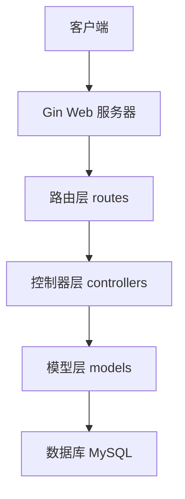

# PCy 个人网络空间

## 项目说明
这是一个使用 Go 语言开发的个人网络空间系统，采用前后端分离架构，提供 RESTful API 接口。系统集成了用户管理、博客文章、分类管理等功能。

## 系统架构


## 目录结构
```
PCy/
├── config/             # 配置文件
│   └── database.go     # 数据库配置
├── controllers/        # 控制器
│   ├── post.go        # 文章控制器
│   └── user.go        # 用户控制器
├── models/            # 数据模型
│   ├── post.go        # 文章模型
│   └── user.go        # 用户模型
├── routes/            # 路由配置
│   └── router.go      # 路由定义
├── main.go           # 程序入口
└── README.md         # 项目说明
```

## 功能模块

### 1. 用户系统
- 用户注册
  - 支持用户名、邮箱、昵称注册
  - 密码使用 bcrypt 加密存储
  - 自动校验用户名唯一性
- 用户登录
  - 支持用户名密码登录
  - 登录状态管理（计划使用 JWT）

### 2. 文章系统
- 文章管理
  - 创建文章：标题、内容、摘要、分类、标签
  - 更新文章：支持修改所有字段
  - 删除文章：软删除
  - 文章状态：已发布/草稿
- 文章列表
  - 分页查询
  - 支持按时间排序
  - 返回文章总数
- 文章详情
  - 关联作者信息
  - 自动统计浏览次数

## 数据模型

### User 用户模型
```go
type User struct {
    ID        uint      `json:"id"`
    Username  string    `json:"username"`  // 用户名
    Password  string    `json:"-"`         // 密码（加密存储）
    Email     string    `json:"email"`     // 邮箱
    Nickname  string    `json:"nickname"`  // 昵称
    CreatedAt time.Time `json:"created_at"`
    UpdatedAt time.Time `json:"updated_at"`
}
```

### Post 文章模型
```go
type Post struct {
    ID          uint      `json:"id"`
    Title       string    `json:"title"`       // 标题
    Content     string    `json:"content"`     // 内容
    Summary     string    `json:"summary"`     // 摘要
    UserID      uint      `json:"user_id"`     // 作者ID
    Category    string    `json:"category"`    // 分类
    Tags        string    `json:"tags"`        // 标签
    ViewCount   int       `json:"view_count"`  // 浏览次数
    IsPublished bool      `json:"is_published"`// 是否发布
    CreatedAt   time.Time `json:"created_at"`
    UpdatedAt   time.Time `json:"updated_at"`
    User        User      `json:"user"`        // 关联作者信息
}
```

## API 接口

### 用户接口
```
POST /api/register     # 用户注册
请求体：
{
    "username": "string",  // 必填，3-50字符
    "password": "string",  // 必填，最少6字符
    "email": "string",     // 必填，有效邮箱
    "nickname": "string"   // 选填
}

POST /api/login        # 用户登录
请求体：
{
    "username": "string",  // 必填
    "password": "string"   // 必填
}
```

### 文章接口
```
GET /api/posts         # 获取文章列表
参数：
- page: int           # 页码，默认1
- page_size: int      # 每页数量，默认10

GET /api/posts/:id     # 获取文章详情

POST /api/posts        # 创建文章
请求体：
{
    "title": "string",      // 必填
    "content": "string",    // 必填
    "summary": "string",    // 选填
    "category": "string",   // 选填
    "tags": "string",       // 选填
    "is_published": bool    // 选填
}

PUT /api/posts/:id     # 更新文章
请求体：同创建文章

DELETE /api/posts/:id  # 删除文章
```

## 环境要求
- Go 1.16+
- MySQL 5.7+

## 配置说明
1. 数据库配置
   - 默认数据库名：pcy
   - 默认用户名：root
   - 默认密码：123456
   - 默认主机：127.0.0.1
   - 默认端口：3306

## 运行说明
1. 确保 MySQL 服务已启动
2. 修改 config/database.go 中的数据库配置
3. 运行 `go run main.go`
4. 访问 http://localhost:8080

## 默认账户
- 用户名：admin
- 密码：123456

## 开发计划

### 已完成功能
- [x] 基础框架搭建
- [x] 数据库配置
- [x] 用户注册登录
- [x] 文章 CRUD
- [x] 分页查询

### 待开发功能
- [ ] JWT 认证
- [ ] 文件上传
- [ ] 评论系统
- [ ] 用户权限
- [ ] 搜索功能 