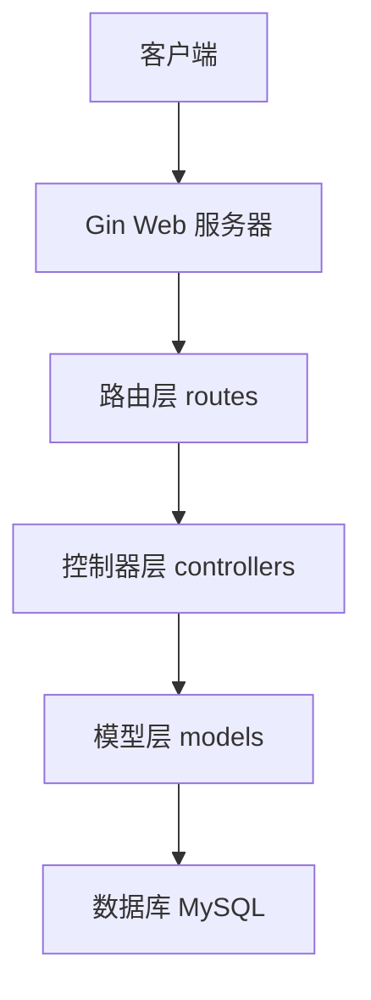

# PCy 个人网络空间

## 项目介绍
PCy是一个使用Go语言开发的现代化个人网络空间系统。它采用前后端分离架构，基于Gin框架提供RESTful API接口，使用GORM作为ORM框架，MySQL作为数据存储。系统提供了用户管理、博客文章、分类管理等核心功能，支持响应式Web界面。

## 技术栈
- 后端框架：Gin v1.9.1
- 数据库：MySQL 5.7+
- ORM框架：GORM v1.25.12
- 前端框架：Bootstrap
- 开发语言：Go 1.20+
- 依赖管理：Go Modules

## 系统架构


## 目录结构
```
PCy/
├── config/             # 配置文件
│   └── database.go     # 数据库配置和初始化
├── controllers/        # 控制器层
│   ├── post.go        # 文章相关控制器
│   └── user.go        # 用户相关控制器
├── models/            # 数据模型层
│   ├── post.go        # 文章模型及方法
│   └── user.go        # 用户模型及方法
├── routes/            # 路由配置
│   └── router.go      # 路由定义和中间件
├── web/              # Web资源文件
│   ├── static/       # 静态资源
│   └── templates/    # HTML模板
├── main.go           # 程序入口
├── go.mod            # Go模块依赖
├── go.sum            # 依赖版本锁定
└── README.md         # 项目文档
```

## 核心功能

### 1. 用户系统
- 用户注册
  - 支持用户名、邮箱、昵称注册
  - 密码使用bcrypt加密存储
  - 自动校验用户名唯一性
  - 支持自定义昵称
- 用户登录
  - 支持用户名密码登录
  - 登录状态管理
  - 密码加密传输

### 2. 文章系统
- 文章管理
  - 创建文章：支持标题、内容、摘要、分类、标签
  - 更新文章：支持修改所有字段
  - 删除文章：支持软删除
  - 文章状态：支持发布/草稿状态
- 文章列表
  - 支持分页查询
  - 支持按时间排序
  - 返回文章总数
  - 支持按分类筛选
- 文章详情
  - 关联作者信息展示
  - 自动统计浏览次数
  - 支持Markdown格式

## 页面路由
- `/` - 封面页
- `/cover` - 封面页（别名）
- `/home` - 主页
- `/blog` - 博客列表页
- `/blog/post/:id` - 文章详情页
- `/login` - 登录页
- `/register` - 注册页

## API接口

### 用户接口
```
POST /api/register     # 用户注册
请求体：
{
    "username": "string",  # 必填，3-50字符
    "password": "string",  # 必填，最少6字符
    "email": "string",     # 必填，有效邮箱
    "nickname": "string"   # 选填
}

POST /api/login        # 用户登录
请求体：
{
    "username": "string",  # 必填
    "password": "string"   # 必填
}
```

### 文章接口
```
GET /api/posts         # 获取文章列表
参数：
- page: int           # 页码，默认1
- page_size: int      # 每页数量，默认10

GET /api/posts/:id     # 获取文章详情

POST /api/posts        # 创建文章
请求体：
{
    "title": "string",      # 必填
    "content": "string",    # 必填
    "summary": "string",    # 选填
    "category": "string",   # 选填
    "tags": "string",       # 选填
    "is_published": bool    # 选填，默认false
}

PUT /api/posts/:id     # 更新文章
请求体：同创建文章

DELETE /api/posts/:id  # 删除文章
```

## 环境配置
### 系统要求
- Go 1.20+
- MySQL 5.7+
- 支持的操作系统：Linux, macOS, Windows

### 数据库配置
默认配置：
- 数据库名：pcy
- 用户名：root
- 密码：123456
- 主机：127.0.0.1
- 端口：3306

## 快速开始
1. 克隆项目
```bash
git clone https://github.com/yourusername/Personal_Cyberspace.git
cd Personal_Cyberspace
```

2. 安装依赖
```bash
go mod download
```

3. 配置数据库
- 创建数据库：pcy
- 修改 `config/database.go` 中的数据库配置

4. 运行项目
```bash
go run main.go
```

5. 访问系统
- 打开浏览器访问：http://localhost:8080
- 默认管理员账号：
  - 用户名：admin
  - 密码：123456

## 开发计划

### 已实现功能
- [x] 基础框架搭建
- [x] 数据库配置和初始化
- [x] 用户注册和登录
- [x] 文章CRUD操作
- [x] 分页查询
- [x] 响应式前端界面
- [x] 文章分类功能

### 待开发功能
- [ ] JWT身份认证
- [ ] 文件上传功能
- [ ] 评论系统
- [ ] 用户权限管理
- [ ] 全文搜索功能
- [ ] 文章统计分析
- [ ] 邮件通知系统
- [ ] 移动端适配优化

## 贡献指南
欢迎提交问题和功能需求！如果你想贡献代码：
1. Fork 本仓库
2. 创建你的特性分支 (`git checkout -b feature/AmazingFeature`)
3. 提交你的修改 (`git commit -m 'Add some AmazingFeature'`)
4. 推送到分支 (`git push origin feature/AmazingFeature`)
5. 开启一个 Pull Request

## 许可证
本项目采用 MIT 许可证 - 查看 [LICENSE](LICENSE) 文件了解详细信息
