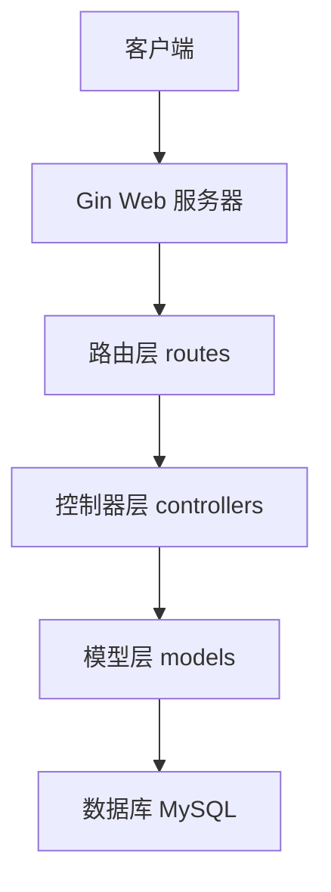

# PCy 个人网络空间

## 项目介绍
PCy 是一个使用 Go 语言开发的现代化个人网络空间系统。它采用前后端分离架构，基于 Gin 框架提供 RESTful API 接口，使用 GORM 作为 ORM 框架，MySQL 作为数据存储。系统提供了用户管理、博客文章、分类管理等核心功能，支持响应式 Web 界面。

## 技术栈
- 后端框架：Gin v1.9.1
- 数据库：MySQL 5.7+
- ORM框架：GORM v1.25.12
- 前端框架：Bootstrap 5
- Markdown渲染：marked.js
- 开发语言：Go 1.20+
- 依赖管理：Go Modules

## 系统架构


## 目录结构
```
PCy/
├── config/             # 配置文件
│   └── database.go     # 数据库配置和初始化
├── controllers/        # 控制器层
│   ├── post.go        # 文章相关控制器
│   └── user.go        # 用户相关控制器
├── models/            # 数据模型层
│   ├── post.go        # 文章模型及方法
│   └── user.go        # 用户模型及方法
├── routes/            # 路由配置
│   └── router.go      # 路由定义和中间件
├── utils/            # 工具函数
│   └── article_loader.go # Markdown文章加载器
├── web/              # Web资源文件
│   ├── static/       # 静态资源
│   │   ├── css/     # 样式文件
│   │   ├── js/      # JavaScript文件
│   │   └── images/  # 图片资源
│   └── templates/    # HTML模板
├── main.go           # 程序入口
└── README.md         # 项目文档
```

## 核心功能

### 1. 用户系统
- 用户注册
  - 支持用户名、邮箱注册
  - 密码使用 bcrypt 加密存储
  - 自动校验用户名唯一性
  - 支持自定义昵称
- 用户登录
  - 支持用户名密码登录
  - JWT 令牌认证
  - 登录状态管理

### 2. 文章系统
- 文章管理
  - Markdown 格式支持
  - 文章元数据管理（标题、作者、发布时间等）
  - 文章分类和标签
  - 浏览次数统计
- 文章展示
  - 响应式布局
  - Markdown 实时渲染
  - 代码高亮
  - 图片自适应
- 文章列表
  - 分页加载
  - 按时间排序
  - 分类筛选

### 3. 页面路由
- `/` - 封面页
  - 现代化设计
  - 快速导航
- `/home` - 主页
  - 功能概览
  - 最新动态
- `/blog` - 博客列表
  - 文章预览
  - 分页浏览
  - 分类导航
- `/blog/post/:id` - 文章详情
  - Markdown 渲染
  - 作者信息
  - 发布时间
  - 阅读统计

## API 接口

### 用户接口
```
POST /api/register     # 用户注册
POST /api/login        # 用户登录
```

### 文章接口
```
GET    /api/posts      # 获取文章列表
GET    /api/posts/:id  # 获取文章详情
POST   /api/posts      # 创建文章
PUT    /api/posts/:id  # 更新文章
DELETE /api/posts/:id  # 删除文章
```

## 特色功能

### 1. Markdown 支持
- 实时渲染
- 代码高亮
- 表格支持
- 图片优化

### 2. 响应式设计
- 移动端适配
- 自适应布局
- 优雅降级

### 3. 性能优化
- 数据库索引优化
- 事务处理
- 缓存支持

### 4. 安全特性
- 密码加密存储
- SQL注入防护
- XSS防护
- CSRF防护

## 开发计划

### 近期计划
- [ ] 添加文章评论功能
- [ ] 实现文章搜索
- [ ] 添加用户头像支持
- [ ] 集成图片上传功能

### 长期规划
- [ ] 添加文章订阅功能
- [ ] 实现多主题支持
- [ ] 添加后台管理系统
- [ ] 优化移动端体验

## 贡献指南

1. Fork 本仓库
2. 创建特性分支 (`git checkout -b feature/AmazingFeature`)
3. 提交更改 (`git commit -m 'Add some AmazingFeature'`)
4. 推送到分支 (`git push origin feature/AmazingFeature`)
5. 开启一个 Pull Request

## 许可证
本项目采用 MIT 许可证
